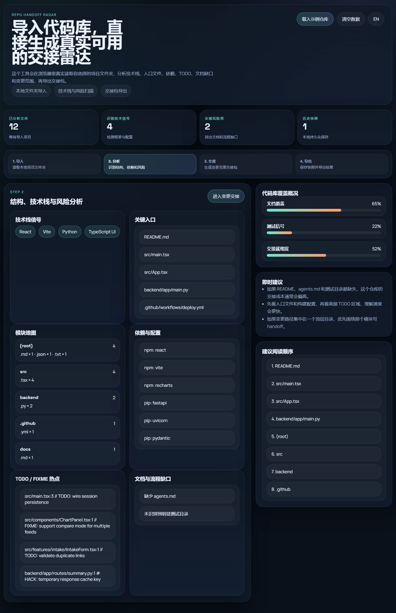
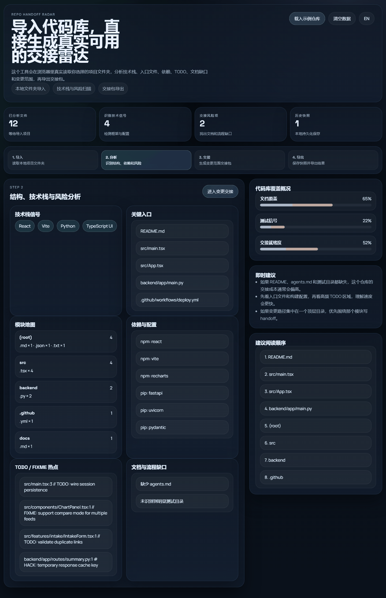

# Repo Handoff Radar

## 中文介绍

### 这是什么

Repo Handoff Radar 是一个真正可用的本地优先代码库交接工具。你可以直接选择本地项目文件夹，它会在浏览器里真实读取文件名和可解析文本文件，分析技术栈、入口文件、依赖、TODO/FIXME、文档缺口和建议阅读顺序。

它不是一个“假装懂代码库”的概念页，也不依赖模型 key。发布后的 GitHub Pages 版本就能直接使用核心能力：导入文件夹、扫描代码库、粘贴变更路径、生成 Markdown 交接包、导出 JSON、保存本地快照。

### 创新点

- 直接在静态页面里做本地文件夹级代码库扫描，不用后端也能产出真实可交接的仓库雷达。
- 把“仓库结构理解 + TODO 热点 + 文档缺口 + 变更范围 handoff”合并成一个连续流程，而不是拆成多个零散工具。
- 对“没有模型、没有后端”的场景给出诚实可用的平替：用真实文件解析和规则分析替代空壳 AI 承诺。
- 新增模块风险热点、文件路径搜索和 scoped checklist，让交接更接近真实接手流程。

### 灵感来源

- [LINUX DO: 一个旧项目乱成一团，你会从哪里开始看？](https://linux.do/t/topic/807099)
- [LINUX DO: 根据真实代码变更范围同步更新 README / Wiki 的 Prompt 和工作流](https://linux.do/t/topic/511604)
- [掘金: 前端 AI Coding 落地指南（一）架构篇](https://juejin.cn/post/7603347438013480995)
- [掘金: Tokenmaxxing：AI写了更多代码，但你的团队可能并没有更高效](https://juejin.cn/post/7630728828343812115)

这些当天调研到的讨论都在指向同一件事：接手老项目越来越难，文档更新经常跟不上真实代码，AI 帮忙前也需要先把仓库结构和变化范围看清楚。这个项目就是在没有模型依赖的前提下，把这件事真的做成一个可用工具。

### 预览





### 功能

- 导入本地项目文件夹，真实读取文件路径和可解析文本文件。
- 检测技术栈、入口文件、依赖清单、模块地图和建议阅读顺序。
- 扫描 TODO / FIXME / HACK 热点，快速识别风险区域。
- 生成模块风险热点排行，优先告诉你哪里最可能有坑。
- 支持文件路径搜索，快速确认某个目录或文件是否在仓库里。
- 检测 README、`agents.md`、测试、CI、`.env.example` 等文档和流程缺口。
- 支持粘贴变更文件路径，生成 scoped handoff Markdown。
- 根据变更范围自动生成 scoped checklist，方便交接前逐项确认。
- 支持保存快照、对比历史、导出 Markdown、导出和导入 JSON。
- 内置可见的中英文切换按钮。

### 真实可用性说明

- GitHub Pages 上线版本的核心能力是真实可用的：文件夹导入、规则分析、交接包生成、快照与导出都可以直接使用。
- 当前没有接入大模型 API，也没有后端数据库；这是一个刻意选择的可运行平替，而不是未完成的占位方案。
- 如果后续要升级，可以额外接入模型来做更高级的摘要或任务拆解，但当前主能力不依赖这些外部服务。

### 使用方式

1. 点击“选择项目文件夹”，导入本地仓库，或先点击“载入示例仓库”试玩。
2. 在分析页查看技术栈、入口文件、模块地图、TODO 热点和文档缺口。
3. 在变更交接页粘贴这次修改涉及的文件路径。
4. 复制或导出生成的 Markdown 交接包。
5. 保存快照，之后可以继续载入和对比。

### 本地运行

```bash
python -m http.server 4185
```

然后访问 `http://127.0.0.1:4185/`。

## English

### What It Is

Repo Handoff Radar is a real local-first repo handoff tool. You can choose a local project folder and the app will read file names and parseable text files directly in the browser, then detect stack signals, entry files, dependencies, TODO/FIXME hotspots, documentation gaps, and a suggested reading order.

It is not a fake “AI understands your repo” landing page, and it does not depend on model keys. The published GitHub Pages build already supports the real core workflow: folder import, repo scanning, changed-path input, Markdown handoff generation, JSON export, and local snapshots.

### Innovation

- It performs real local folder-level repo scanning in a static site without needing a backend.
- It combines repo understanding, TODO hotspots, documentation gaps, and scoped handoff output into one continuous workflow.
- It uses honest deterministic analysis as a working substitute instead of pretending missing AI integrations already exist.
- It now adds hotspot ranking, path search, and scoped checklists so the workflow feels closer to real handoff work.

### Inspiration Sources

- [LINUX DO: 一个旧项目乱成一团，你会从哪里开始看？](https://linux.do/t/topic/807099)
- [LINUX DO: 根据真实代码变更范围同步更新 README / Wiki 的 Prompt 和工作流](https://linux.do/t/topic/511604)
- [Juejin: Frontend AI Coding Implementation Guide, Architecture Part](https://juejin.cn/post/7603347438013480995)
- [Juejin: Tokenmaxxing and why more AI code does not always mean more team efficiency](https://juejin.cn/post/7630728828343812115)

These same-day research signals point to the same gap: inheriting messy projects is hard, docs drift from code, and even AI-assisted work needs a clear structural handoff first. This project turns that need into a usable product without external model dependencies.

### Preview


### Features

- Import a local project folder and read real file paths plus parseable text files.
- Detect stack signals, entry files, dependency lists, module map, and suggested reading order.
- Scan TODO / FIXME / HACK hotspots to surface risk zones quickly.
- Rank module hotspots so you can start with the riskiest area first.
- Search file paths to confirm whether a folder or file exists before handoff.
- Detect missing README, `agents.md`, tests, CI, and `.env.example`.
- Paste changed file paths to generate a scoped Markdown handoff pack.
- Generate a scoped checklist from the changed paths before exporting the pack.
- Save snapshots, compare history, and export Markdown or JSON.
- Includes a visible Chinese / English language toggle in the UI.

### What Actually Works

- The GitHub Pages build really supports folder import, deterministic analysis, handoff-pack generation, snapshots, and export.
- There is no model API and no backend database in the current version; that is an intentional working fallback, not a missing placeholder.
- Future upgrades may add model-assisted summarization, but the current main workflow does not depend on external services.

### How To Use

1. Click `Choose project folder` to import a local repo, or start with `Load sample repo`.
2. Review the analysis page for stack signals, entries, module map, TODO hotspots, and gaps.
3. Paste the changed file paths in the scoped handoff step.
4. Copy or export the generated Markdown handoff pack.
5. Save snapshots for later compare or reload.

### Run Locally

```bash
python -m http.server 4185
```

Then open `http://127.0.0.1:4185/`.
